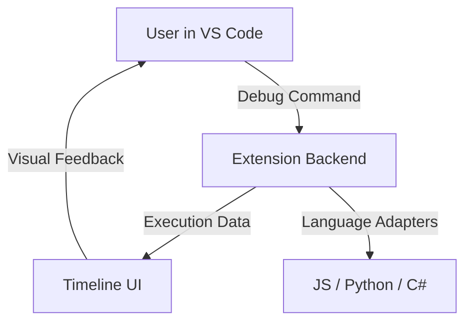

# Code Time Traveler Debugger


_A professional time-travel debugger for **JavaScript, Python, and C#**, letting you replay and scrub through code execution like a video inside VS Code._


---

## ✨ Features

- 🚀 **Start / stop** the Code Time Traveler backend
- 📊 **Interactive Timeline UI** (in browser or inside VS Code)
- 🐍 Supports **JavaScript, Python, and C#** via adapters
- 🎥 Visualize **screenshots, variable graphs**, and program states
- ⏪ Navigate **execution flow like a video player** (step back/forward)
- 🔍 Debug faster by **time-traveling through your code**

---

## 🔧 Installation

1. Open **Visual Studio Code**
2. Go to **Extensions view** (`Ctrl+Shift+X`)
3. Search for **Code Time Traveler Debugger** or run:
   ```bash
   code --install-extension mzainulabideen.code-time-travel-debugger


👉 [**View on VS Code Marketplace →**](https://marketplace.visualstudio.com/items?itemName=MZainUlAbideen.code-time-travel-debugger)

---

## 🚀 Usage

1. Open the Command Palette (`Ctrl+Shift+P`) and run one of the following:

   * ▶️ `Code Time Traveler: Start Debugging`
   * 📂 `Code Time Traveler: Open Timeline UI`
   * ⏹ `Code Time Traveler: Stop Debugging`

2. Integrate the appropriate adapter (JS, Python, or C#) into your app.

3. Run your program and use the **timeline UI** to step backward/forward through execution.

💡 Pro Tip: Use the **Variable Graph** to visualize how variables evolve over time!

---

## 🛠️ Architecture / Workflow



**Flow:**

1. User starts debugging → backend adapter activates
2. Execution data captured → streamed into Timeline UI
3. User interacts visually → scrubs through execution history

---

## ⚙️ Development

Clone the repo and set up:

```bash
git clone https://github.com/ZainulabdeenOfficial/Code-Time-Traveler-Debugger-VS-Code-Extension.git
cd Code-Time-Traveler-Debugger-VS-Code-Extension
npm install
npm run compile
```

For live updates:

```bash
npm run watch
```

To package:

```bash
vsce package
```

### Publishing

1. Ensure `package.json` contains:

   ```json
   "publisher": "mzainulabideen"
   ```
2. Generate a **Personal Access Token (PAT)** with Marketplace rights.
3. Publish:

   ```bash
   vsce login mzainulabideen
   vsce publish
   ```

---

## 🤝 Contributing

Contributions are **welcome & appreciated** 🙌

* Fork this repository
* Create a feature branch
* Commit changes & push
* Open a Pull Request

📌 Please ensure your code is tested and follows the project style guide.

---

## 📜 License

This extension is licensed under the **MIT License**.
[View License →](https://github.com/ZainulabdeenOfficial/Code-Time-Traveler-Debugger-VS-Code-Extension/blob/main/LICENSE)

---

## 📌 Summary

✅ **Badges** for Marketplace, downloads, and license
✅ **Eye-catching screenshots** + Mermaid diagram
✅ **Step-by-step installation & usage**
✅ **Clear developer & publishing guide**
✅ **Inviting contribution section**

> ⚡ Debug smarter. Debug faster. Debug with **Code Time Traveler Debugger**.

```
```
